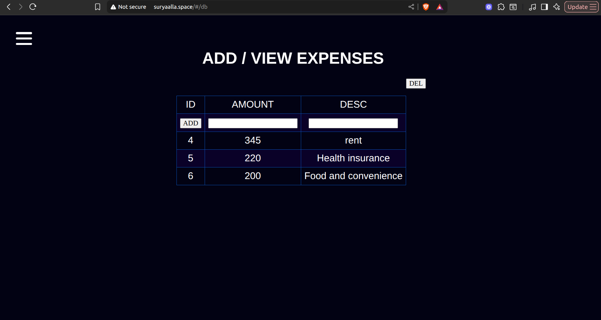

# Expense Project - Manual 3-Tier AWS Deployment

This repository documents deploying a **three-tier Expense Tracker application** manually in AWS, ensuring consistent communication across all layers and validating end-to-end functionality.

***

## 1. Overview

We set up:
- The **frontend** (web server on AWS EC2 with Nginx)
- The **backend** (NodeJS application server)
- The **database** (MySQL server)

All source files are securely stored on AWS and are fetched via `curl` to each server as needed.

***

## 2. DNS & Domain Configuration

A custom domain is provisioned. The domain’s nameservers are updated for AWS Route 53 hosting, enabling public access and robust DNS management.

For a comprehensive explanation of DNS, see:  
[Domain Name System - suryaalla.medium.com](https://suryaalla.medium.com/domain-name-system-5ffbfd21d37c)

***

## 3. Architecture Details

The solution is organized as a classic **three-tier architecture**:

- **Frontend:** Serves static content and acts as a reverse proxy.
- **Backend:** Processes logic, APIs, and database connectivity.
- **Database:** Stores and manages expense records.

Learn more about the architecture here:  
[3-Tier Architecture Explained](https://suryaalla.medium.com/3-tier-architecture-af59fe09f493)

***

## 4. Application Testing

### Live Functionality

- After deployment, perform web-based transaction entries.
- Validate that data gets stored correctly in the MySQL database schema.

### Screenshots

#### Web Application — Expense Entry Table
Shows how users can add or view expense records:

#### Web Application — Main Landing Page
Displays the Expense App’s introductory screen:

#### Web Application — Multi window in Terminator linux
Displays the multiple window connections made with frontend server,
backend server, database server

#### How AWS - 3 tier looks
Displays the 3 tier architecture in aws --- 
frontend server, backend server, database server

***

## 5. How It Works

- All testing occurs on the live web app, ensuring the frontend updates, backend logic, and database consistency.
- Source files are fetched directly to AWS servers using `curl` for automated, up-to-date deployments.

***

## 6. Notes

- For efficient Route 53 integration, update your nameservers as soon as you register your domain.
- This manual deployment approach provides full control and transparency over every component.

***

**Explore the real-time results using the attached screenshots for insight into the running Expense Tracker system.**